# a2meter

**AION2 실시간 DPS 미터기**

전투 중 DPS와 피해 기여도를 확인하고, 보스 HP·그로기·버프·스킬 쿨타임을 별도 창으로 표시합니다. 스킬별 상세 분석과 저장된 전투 리플레이도 지원합니다.

> 현재 소스의 **2.8.1 버전** 기준입니다. 이미지는 실제 WPF UI에 **가상의 샘플 전투 데이터**를 넣어 렌더링했습니다. 닉네임은 **별표 마스킹**으로 표시했으며, 상세·파티·리플레이에도 실제 플레이어 정보를 사용하지 않았습니다. 수치는 직업 성능 비교 자료가 아닙니다.

## 시작하기

1. 배포 파일을 압축 해제하고 **a2meter.exe**를 실행합니다. **관리자 권한이 필요합니다.**
2. **⚙ 설정 → 시스템**에서 캡처 모드를 확인합니다. WinDivert와 Npcap 경로를 지원하며, Npcap 사용 시 해당 드라이버가 필요합니다.
3. 게임에서 전투를 시작하면 수집된 타겟과 플레이어별 DPS가 표시됩니다.
4. 표시할 정보와 보조 창을 설정한 뒤 **저장**합니다. 설정은 실행 폴더의 `window_config.json`에 보관됩니다.

배포 구성에 따라 **.NET 8 Desktop Runtime(x64)**이 필요합니다. 함께 제공되는 네이티브 DLL·드라이버·리소스 파일은 배포 구조를 유지해 주세요.

## 1. 메인 미터기

| 항목 | 기능 |
| --- | --- |
| 타겟 선택 | 수집된 전투 타겟을 선택해 해당 전투의 통계 확인 |
| 전투 요약 | 전투 시간, 합산 DPS, 누적 딜량 |
| 플레이어 목록 | 직업 아이콘, DPS, 피해 기여도, 강타 비율 |
| 플레이어 정보 | 전투력·장비레벨·아툴 점수 표시 여부 선택 |
| 비율 표시 | 총 데미지 대비 기여도 또는 타겟 최대 HP 대비 피해 비율 |
| 대미지바 | 비율 표시 기준 또는 1등 기준으로 채우기 |
| 숫자 형식 | 전체 숫자 또는 K/M/B 단위 |
| 필터 | 보스만 표시, 본인만 표시, 미확인 닉네임·NPC 숨기기 |
| 닉네임 | 없음 / 별표 처리 / 랜덤 마스킹 |
| 핑 | TCP 통신을 바탕으로 추정한 지연 표시 |

### 누적 딜량 대신 남은 HP 표시

**설정 → 표시 → 누적 딜량 대신 남은 HP(%) 표시**를 켜면, 메인 상단 오른쪽의 누적 딜량 자리에 **선택한 타겟의 남은 HP**가 표시됩니다.

| 옵션 꺼짐: 누적 딜량 | 옵션 켜짐: 남은 HP |
| --- | --- |
| 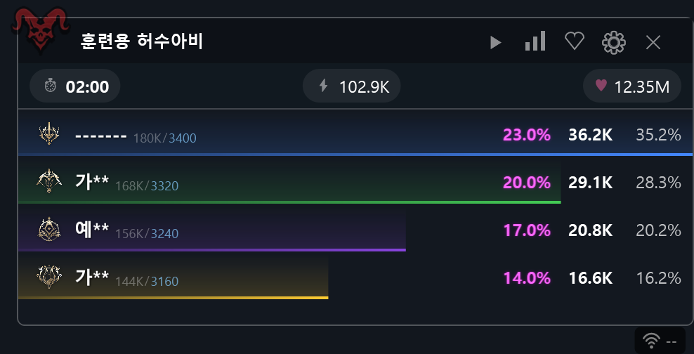 |  |

- HP는 **75.3%**처럼 **소수점 첫째 자리까지** 표시합니다.
- HP 정보가 수집되지 않았으면 **--**를 표시합니다.
- 옵션을 끄면 기존 누적 딜량 표시로 돌아갑니다.
- 플레이어별 피해 비율 옵션과는 별도의 설정입니다.

### 버튼과 조작

| 버튼 / 조작 | 기능 |
| --- | --- |
| ▶ | 전투 리플레이 열기 |
| 막대그래프 아이콘 | 선택한 타겟의 버프·디버프 유지내역 열기 |
| ♡ | 보스 HP 바 사용 전환 |
| ⚙ | 설정 열기 |
| 플레이어 행 우클릭 또는 더블클릭 | 해당 플레이어의 상세 분석 열기 |

## 2. 스킬 상세 분석

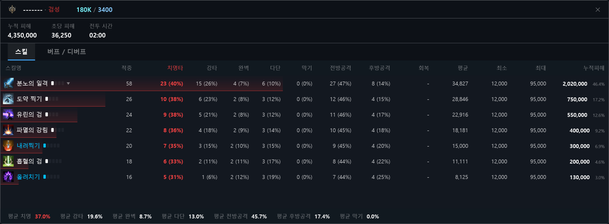

- 스킬별 누적 피해량과 기여도, 적중 횟수를 확인합니다.
- 치명타·강타·완벽·다단·막기와 **전방공격·후방공격**을 비교합니다.
- 평균·최소·최대 피해량과 회복량을 확인합니다.
- **스킬 그룹화**로 관련 스킬을 묶고, 화살표로 하위 내역을 펼칠 수 있습니다.
- **버프 / 디버프** 탭에서 전투 중 유지내역을 확인합니다.

## 3. 보스 HP와 그로기

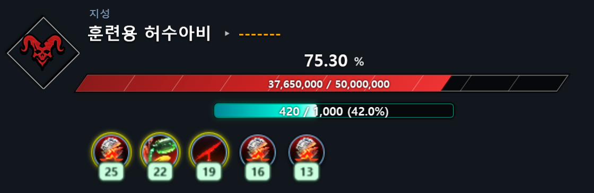

보스 전용 창에서 HP 수치와 비율, 그로기 게이지, 타겟에 적용된 버프·디버프를 확인합니다. 표시 조건을 만족하는 전투에서 자동으로 나타나며, HP가 0이 되면 잠시 후 숨겨집니다.

**설정 → 보스**에서 보스 전용 창, 디버프 필터와 별도 디버프 창을 설정할 수 있습니다. 아이콘의 남은 시간과 본인이 적용한 효과의 테두리 강조도 지원합니다.

## 4. 버프·디버프와 스킬 쿨타임

### 버프 전용 창

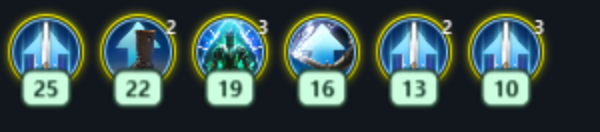

**설정 → 버프**에서 버프 전용 창을 켜고, 아이콘 크기와 표시할 버프를 선택합니다. 트레이로 숨길 때 함께 숨기는 옵션도 제공합니다.

### 스킬 쿨타임 창

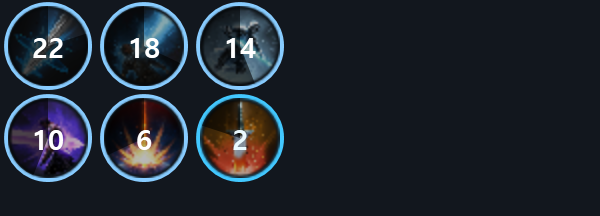

본인과 파티원의 스킬 쿨타임을 남은 시간과 원형 게이지로 표시합니다. **설정 → 버프**에서 쿨타임 창을 켠 뒤 **스킬 쿨타임 필터 설정**으로 추적할 스킬을 선택합니다. 파티원 쿨타임을 윗줄에 놓거나 아이콘 테두리와 색상을 조절할 수 있습니다.

### 버프·디버프 유지내역

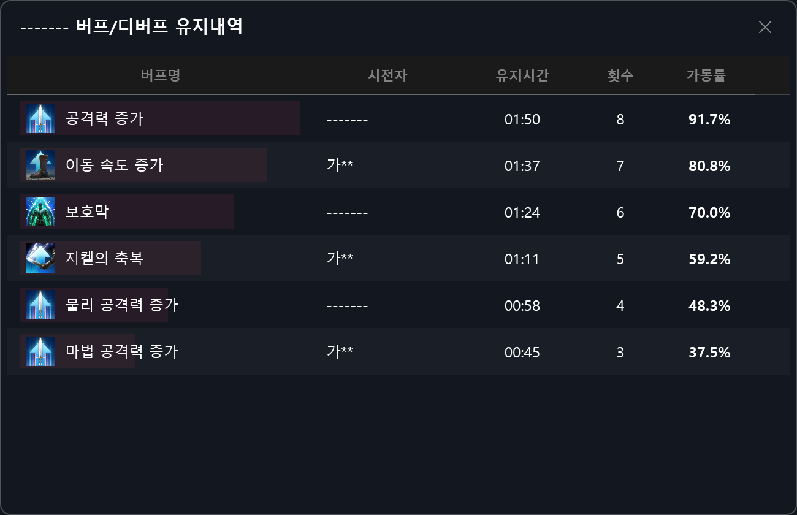

효과별 **시전자, 유지시간, 횟수, 가동률**을 확인합니다. 보스의 디버프 유지율이나 플레이어의 버프 적용 내역을 살펴볼 때 사용할 수 있습니다.

## 5. 파티 정보

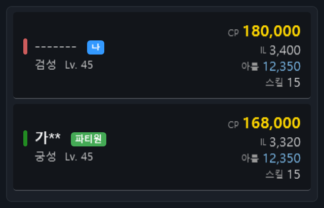

파티 신청자와 파티원 정보를 별도 창에서 확인합니다. **설정 → 파티**에서 표시 항목을 선택할 수 있습니다.

- 직업과 레벨
- 전투력·장비레벨·아툴 점수·스킬 레벨·칭호
- 액티브·패시브·스티그마 스킬
- 플레이어별 메모

실제로 수집하거나 조회한 정보만 표시되며, 아직 확인되지 않은 값은 비어 있거나 **—**로 표시됩니다.

## 6. 전투 기록과 리플레이

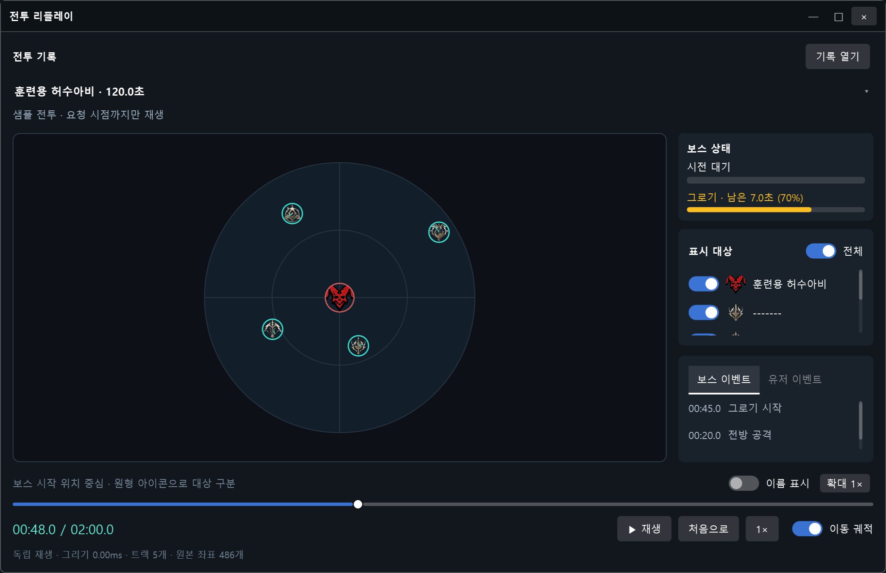

메인 화면의 **▶** 버튼으로 전투 리플레이를 엽니다.

- 플레이어와 보스의 위치, 이동 궤적을 시간대별로 확인합니다.
- 보스 시전과 그로기 구간, 보스·유저 이벤트를 확인합니다.
- 재생·일시정지, 처음으로 이동, 재생 배속과 타임라인 탐색을 지원합니다.
- 대상별 표시 전환, 이름 표시, 확대와 이동 궤적 표시를 조절할 수 있습니다.
- **기록 열기**에서 저장한 HTML 전투 기록을 불러올 수 있습니다.

**설정 → 표시 → 전투 기록 HTML 저장**을 켜면 기록이 실행 폴더의 `records/YYYY-MM-DD.html`에 날짜별로 누적됩니다. HTML 파일은 브라우저에서 직접 열어볼 수도 있습니다. 저장된 전투 외에도 앱 메모리에 남아 있는 전투와 현재 전투의 스냅샷을 리플레이 목록에서 확인할 수 있습니다.

리플레이는 수집된 데이터 범위까지 재생합니다. 위치 정보가 없는 대상은 이동 경로가 표시되지 않습니다.

## 7. 설정 화면

설정은 **저장** 버튼을 눌러 적용합니다. 이미지의 값은 설명을 위한 예시이며, 기존 `window_config.json`이 있으면 저장된 값이 사용됩니다.

<b>표시 — 집계, HP 비율, 숫자 형식, 닉네임 마스킹</b>

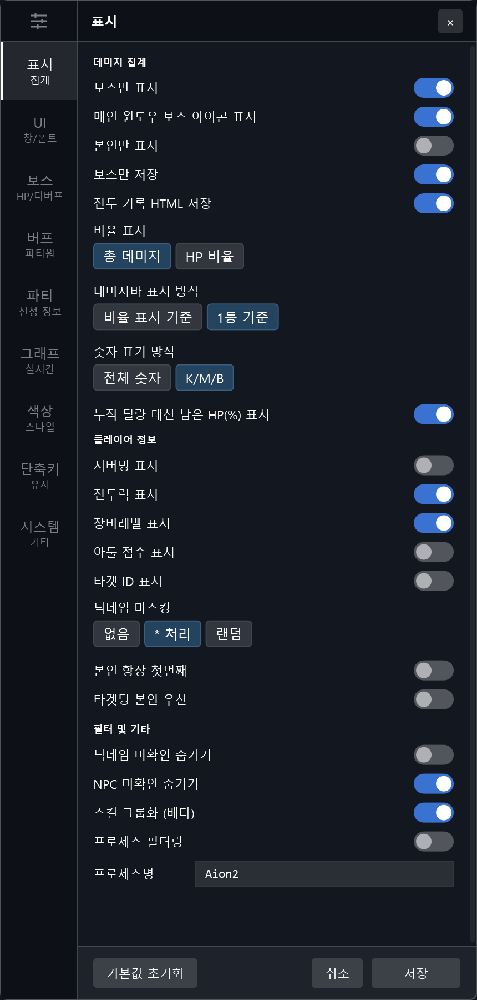

<b>UI — 창 배율, 투명도, 글꼴, 표시 항목</b>

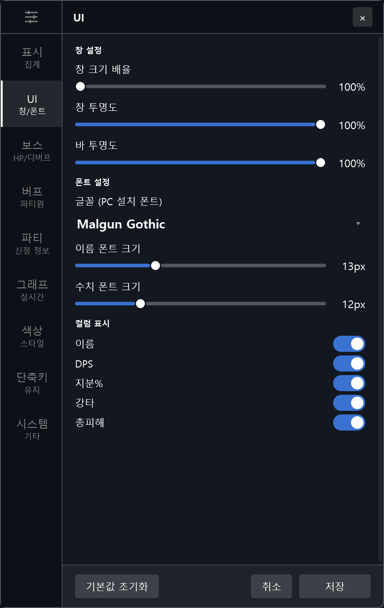

<b>보스 — HP 바, 디버프 필터, 디버프 창</b>

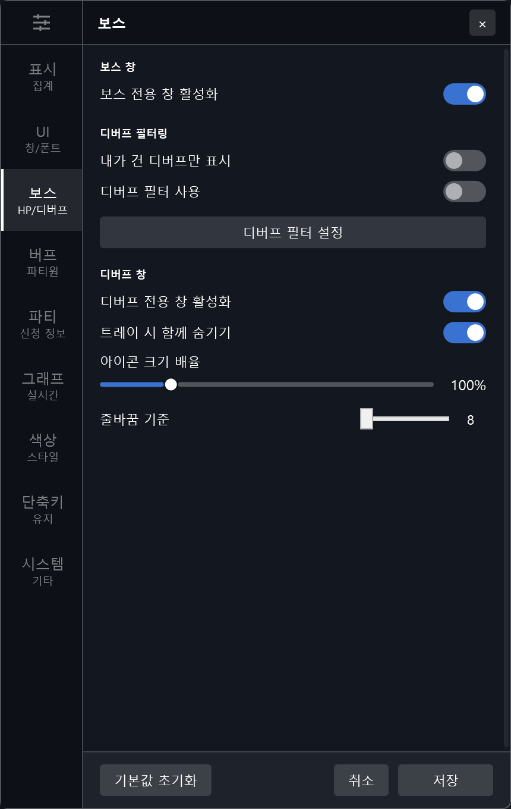

<b>버프 — 버프 창, 필터, 스킬 쿨타임</b>

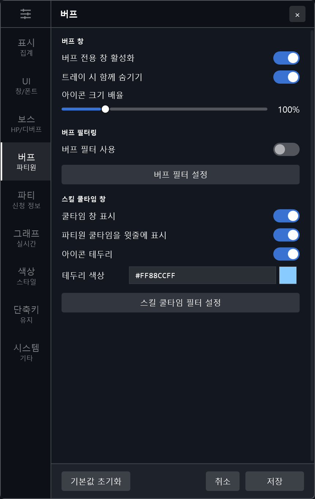

<b>파티 — 신청자·파티원 정보, 표시 항목</b>

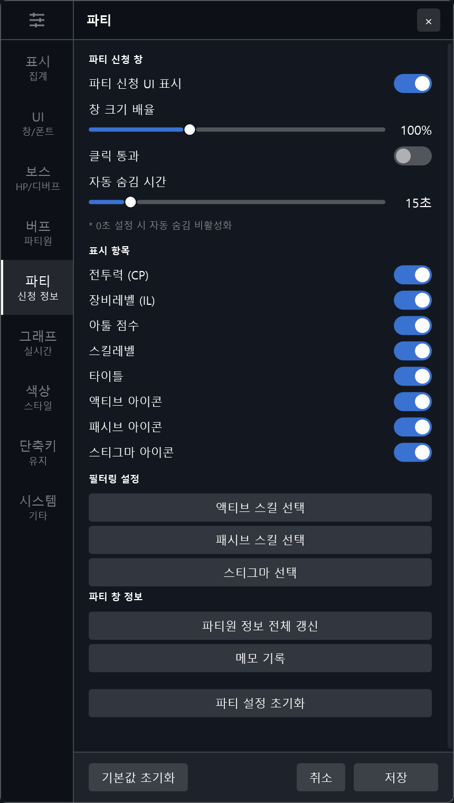

<b>색상 — 본인 버프 강조, 글자·배경·직업 색상</b>

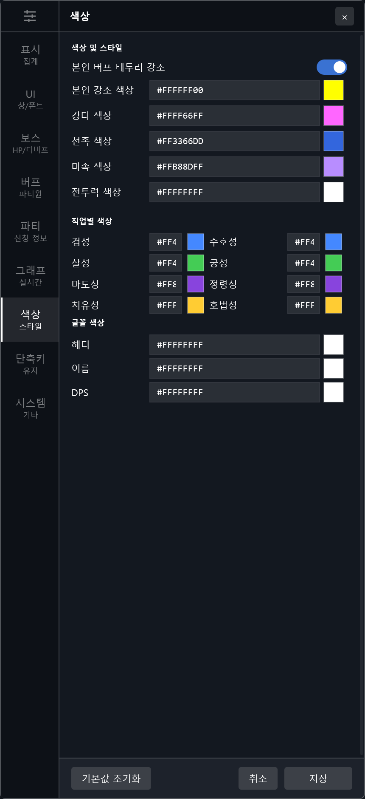

<b>단축키 — 초기화, 트레이, 클릭 통과</b>

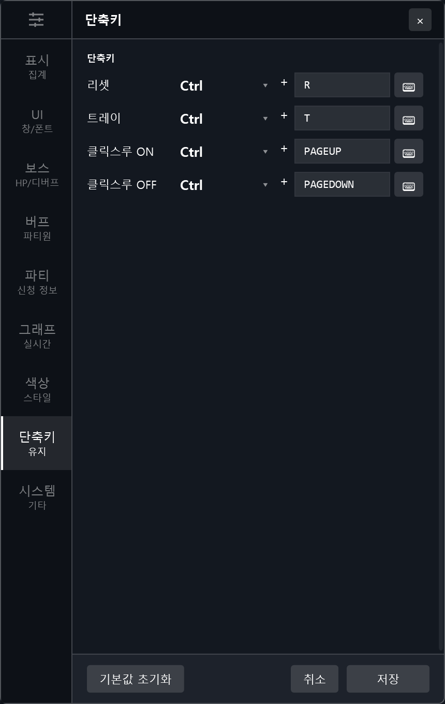

<b>시스템 — 캡처 모드, 언어, 최적화</b>

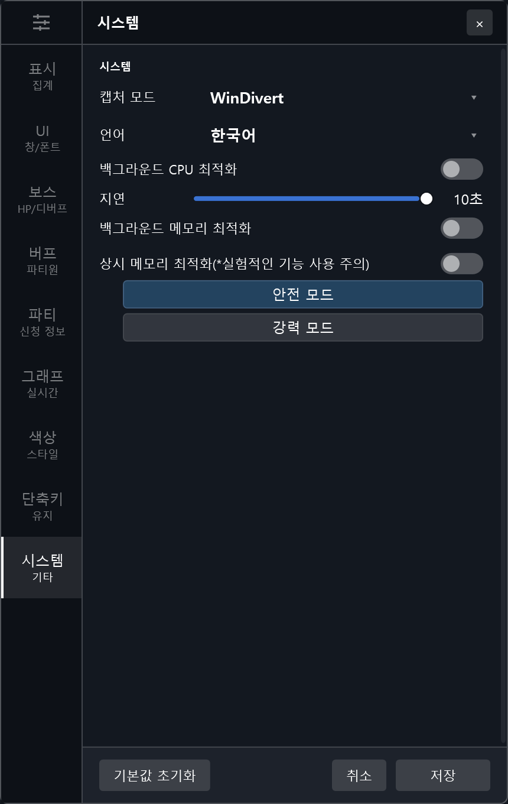

현재 소스의 **그래프 탭은 설정 UI만 남아 있고 실시간 그래프 동작에는 연결되어 있지 않습니다.** 위 안내는 실제 연결된 기능을 기준으로 작성했습니다.

## 8. 기본 단축키

| 기능 | 기본값 |
| --- | --- |
| DPS 초기화 | Ctrl + R |
| 트레이 숨김 / 복원 | Ctrl + T |
| 클릭 통과 켜기 | Ctrl + Page Up |
| 클릭 통과 끄기 | Ctrl + Page Down |

단축키는 **설정 → 단축키**에서 변경할 수 있습니다. 실제 동작에는 저장된 설정값이 사용됩니다. 마우스로 창을 조작할 수 없으면 클릭 통과를 꺼 주세요.

[특수 키·넘패드 등 단축키 입력 방법](docs/HOTKEYS.md)

## 개발 및 문서 참고

- [개발 빌드와 진단 로그](docs/DEVELOPMENT.md)
- [전투 세션별 신원 보존](docs/SESSION-IDENTITY.md)
- [문서용 샘플 이미지 생성 방법](Utility/ReadmeScreenshots/README.md)

README의 이미지는 `docs/images/`에 포함되어 있습니다. GitHub에 올릴 때 **README와 이미지 폴더를 함께** 반영하면 별도의 이미지 업로드 없이 표시됩니다.
